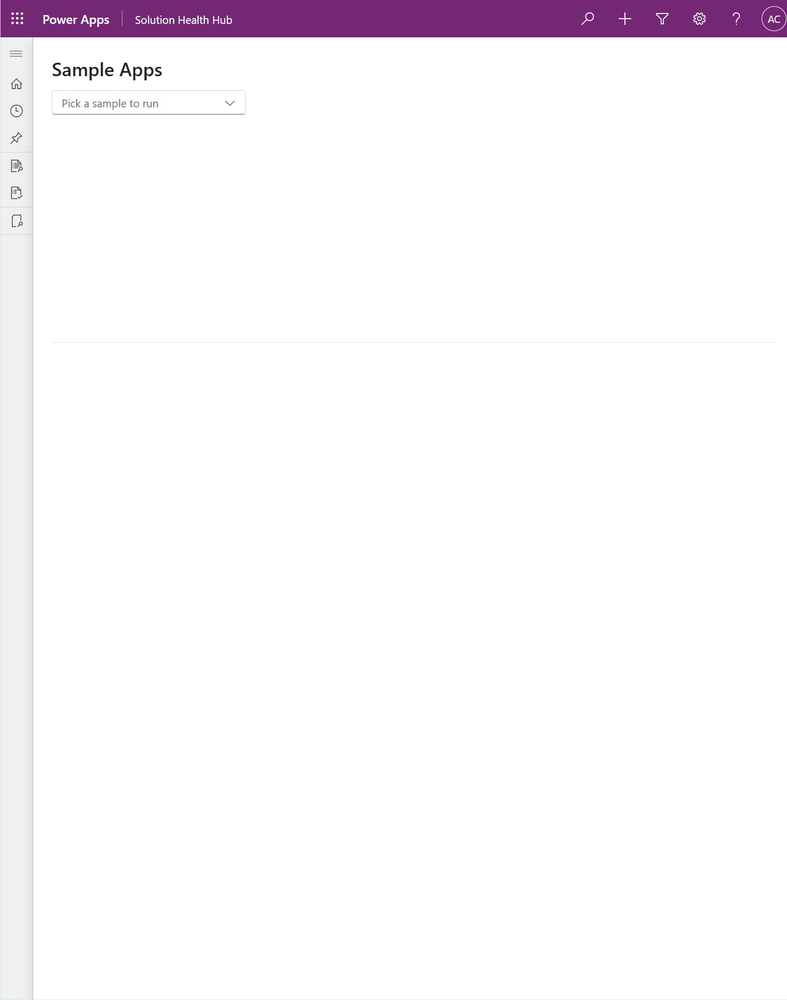

# D365 Client-Side UI Kit

A portable, metadata-aware client-side kit for Microsoft Dynamics 365 / Dataverse.
It renders native-looking custom UI (refreshed Unified Interface, Fluent UI v9) with
full code-level control, and ships it across webresources, PCFs, and form scripts from
one shared library. Built on React 18 + TypeScript. The spiritual successor to
[SparkleXrm](https://github.com/scottdurow/SparkleXrm), carried forward to UCI fidelity
and modern host coverage.



## Why it exists

In normal D365 work, when configuration cannot express exactly what the user needs, you
usually face two bad options: compromise the requirement, or spend a week on a custom POC
that still does not look native. This kit is the third option: native-looking UI with
code-level control, with a realistic target of roughly one day for requirements that are
almost standard but need a programmable seam.

## When to reach for it (and when not)

This is the part worth reading slowly. The kit is not for exotic UI by default. Its
highest-impact case is the gap between what the platform almost does and what the user
actually needs: the requirement is about 90% native, but the host, the interaction, or
the data shape leaves no clean standard path.

| Use native D365 | Use the kit |
|---|---|
| Standard fields on entity forms | Webresource or PCF UI that needs native look with programmatic control |
| Subgrids on forms with no custom interaction | Subgrid-like grids in a webresource you bind, refresh, and handle from code |
| A subgrid bound to one relationship | A grid whose rows come from merged or normalized result sets |
| Single-entity activity subgrids | Activity lists spanning multiple activity types with unified columns and sort |
| Out-of-box lookup behavior | Lookups with custom search, saved-query overrides, or multi-step filtering |
| A standard guided process | A multi-step, gated wizard with an in-memory draft committed at the end, where Power Pages is overkill and a business process flow does not fit (record already on one, or large data volume) |
| "Good enough" standard config | Requirements where users will notice if you compromise |

It is also the wrong tool for a full SPA. The kit's unit of work is a form-shaped View
plus a thin ViewModel. If a requirement is too large to express that way, that is the
signal it has left the kit's band, not a reason to grow the kit. Routing, global state
managers, and composition patterns aimed at full-time frontend teams are deliberately
out of scope.

## How this relates to canvas apps and custom pages

The first reaction to "custom UI in a model-driven app" is usually "use a canvas
app," or more currently "use a custom page." Often that is the right call, and it
solves a different problem than this kit does.

Canvas apps and custom pages are a second app paradigm: Power Fx, a separate
runtime, and a layout-first authoring tool. They shine when the app is standalone,
draws on sources beyond Dataverse, or is built by a citizen developer who will not
write code. If that is your situation, reach for them.

This kit is for the other situation: your entities, forms, views, security, and
metadata already live in a model-driven app, and you have hit the edge of what
configuration expresses. Embedding a custom page there carries costs that are easy
to underestimate:

- **It does not look native.** A custom page renders in its own visual language and
  reads as a foreign object beside UCI forms. Matching the refreshed Fluent v9 look
  is this kit's whole point.
- **It does not inherit your metadata.** Option set labels, number precision, date
  and locale behavior, lookup targets: you redefine the data and rebuild that
  formatting yourself. A metadata-aware control resolves it from Dataverse directly.
- **It is a paradigm to staff and maintain.** Power Fx beside React beside your form
  scripts is three mental models. This kit is React on the metadata you already
  have, in source control and CI, reviewed like the rest of your code.
- **It fights programmable data.** Merged queries, multi-activity lists, custom
  lookup filtering, the cases this kit targets, are where a layout-first low-code
  tool is most awkward.

Short version: canvas and custom pages are the right tool when you build *beside*
your model-driven app. This kit is the right tool when you build *inside* it and
need a native-feeling, programmable seam.

## Architectural stance

Two decisions carry the design.

**A three-layer contract**, enforced by lint, not just convention:

| Layer | Knows CRM? | Queries? | Role |
|---|---|---|---|
| **Presentational** | Never. No context, no entity names | Never | Native-parity UI; renders supplied values and Observables; raises events |
| **Smart (metadata-aware)** | Yes, via `IViewModelContext` | Metadata and standard fetches | `entity` + `attribute` in, resolved presentational child out |
| **ViewModel** | Yes | Anything: merges, multi-query pipelines | Owns Observables and app rules; binds presentational controls |

Presentational controls stay CRM-agnostic so they run in Storybook with zero mocks and
never drift off-brand. Smart controls give you form-designer ergonomics in code: drop a
control into a View with an entity and an attribute, and it resolves labels, option sets,
formats, and lookup targets from Dataverse metadata.

**MVVM and Observables on purpose, not from habit.** Most D365 teams ship a handful of
UI surfaces across an implementation, then return months later for a small change. Hooks
fluency is perishable under that cadence; every return visit pays a relearning tax. View
plus ViewModel plus Observables stays re-legible: open the ViewModel, see the data and
rules; open the View, see the controls. It reads like the form scripts these developers
already maintain. See [docs/architectural-stance.md](docs/architectural-stance.md) for
the full rationale, written so future contributors do not modernize it away by accident.

## Provenance

This kit distills patterns the author has built by hand across years of D365 client
work. This public version was assembled with heavy AI assistance: the architecture, the
constraints, and the API design are the author's; the bulk of the implementation was
generated against that design. The judgment is human, the typing was not.

## Delivery surfaces

One shared library, four places it lands:

| Folder | Surface |
|---|---|
| `shared/` | The portable kit: controls, context adapters, metadata, reactivity, theme |
| `clientui/` | HTML webresource shell: one page, `?app=` registry, MVVM apps |
| `clienthooks/` | `CrmClientSide` UMD bundle for form / ribbon / grid events |
| `pcfs/` | Sample PCF projects importing `shared/` as source |

Runs against modern orgs (v9.2+/UCI) natively, and CRM 8.x servers through a legacy
context adapter. "Legacy" means old server APIs, not old browsers: modern evergreen
browsers only.

## What a View looks like

A View reads like a form layout. Metadata-aware controls take an entity and an attribute,
and the kit does the rest. This is the `template` app, the file you copy to start a new one:

```tsx
export class TemplateView extends ObserverComponent<ITemplateViewProps> {
  constructor(props: ITemplateViewProps) {
    super(props);
    this.observe(props.viewModel.isSaving, props.viewModel.saveMessage);
  }

  override render(): React.ReactNode {
    return <Body {...this.props} />;
  }
}

const Body: React.FC<ITemplateViewProps> = ({ viewModel }) => {
  const styles = useStyles();
  return (
    <div className={styles.page}>
      <Title3>New Account</Title3>

      {/* Form-designer ergonomics: entity + attribute is the whole config. */}
      <SmartTextField entity="account" attribute="name" value={viewModel.accountName} />
      <SmartOptionSet entity="account" attribute="industrycode" value={viewModel.industry} />

      <div className={styles.actions}>
        <Button
          appearance="primary"
          onClick={() => void viewModel.onSave()}
          disabled={viewModel.isSaving.value}
        >
          {viewModel.isSaving.value ? "Saving…" : "Save"}
        </Button>
      </div>
      {viewModel.saveMessage.value ? (
        <div className={styles.message}>{viewModel.saveMessage.value}</div>
      ) : null}
    </div>
  );
};
```

The ViewModel owns the Observables and the save logic. The View just declares controls.

## Getting started

```bash
npm ci
npm run verify        # lint + typecheck + build + tests + smoke + storybook
npm run storybook     # browse the controls with fixture data
```

Browse the controls live in the hosted Storybook:
https://antoniocuegervas.github.io/d365-clientside-kit/

Sample apps live in `clientui/apps/`. Start with `template` (the scaffold to copy),
`sample-company-search` (the flagship 90%-native case: a saved-view grid and editable
lookups in a webresource that behave like form controls), and `sample-master-detail`
(an account grid driving an editable contact form with a field of every type, runs on
any Dataverse org with no extra metadata). Deploy the shell and open it inside a
model-driven app: the webresource needs that app context to receive `Xrm`, see
[docs/deployment.md](docs/deployment.md) ("Hosting the shell"). The `samples` app key
lists every sample from one webresource.

## Where to go deeper

The public guides in `docs/`, in a sensible reading order:

1. [docs/architecture.md](docs/architecture.md): the three-layer contract and boot flow
2. [docs/architectural-stance.md](docs/architectural-stance.md): why MVVM + Observables
3. [docs/adding-a-webresource-app.md](docs/adding-a-webresource-app.md): ship your first app
4. [docs/component-catalog.md](docs/component-catalog.md) and [docs/control-configuration.md](docs/control-configuration.md): controls and their config
5. [docs/adding-a-pcf.md](docs/adding-a-pcf.md) and [docs/adding-a-client-hook.md](docs/adding-a-client-hook.md): the other delivery surfaces
6. [docs/prompt-friendly-development.md](docs/prompt-friendly-development.md): generating apps with coding agents
7. [docs/testing.md](docs/testing.md) and [docs/deployment.md](docs/deployment.md): verify and publish
8. [docs/gotchas.md](docs/gotchas.md): sharp edges that are not obvious from the type signatures

The full design document and decision log live in
[docs/internal/](docs/internal/) for anyone curious about the reasoning behind the
constraints. They are background, not required reading.

## Status

A working v1: the architecture, the three-layer contract, the shell, sample apps, sample
PCFs, and the client-hooks framework are all in place and pass the local verification
gate (lint, typecheck, both bundle builds, unit tests, modern and legacy host smoke
tests, and a Storybook build). It has been deployed to and exercised against a live
Dataverse v9 org using standard entities. It is a foundation built to be extended, not a
finished product with a long track record.

## Contributing and reuse

This repo is meant to be built on. To start your own D365 client-side project,
use it as a template (the "Use this template" button, or copy the repo) and own
your copy from there; a template copy has no upstream link, so it will not pull
kit updates automatically. To contribute a fix to the kit itself, fork and open
a pull request against `master` (a template-derived copy shares no history and
cannot open a clean PR). The architecture (MVVM, Observables, class components)
and the authoring rules are intentional and enforced, so read
[CONTRIBUTING.md](CONTRIBUTING.md) before opening a pull request.

## License

Released under the Apache License 2.0. See [LICENSE](LICENSE) and [NOTICE](NOTICE).