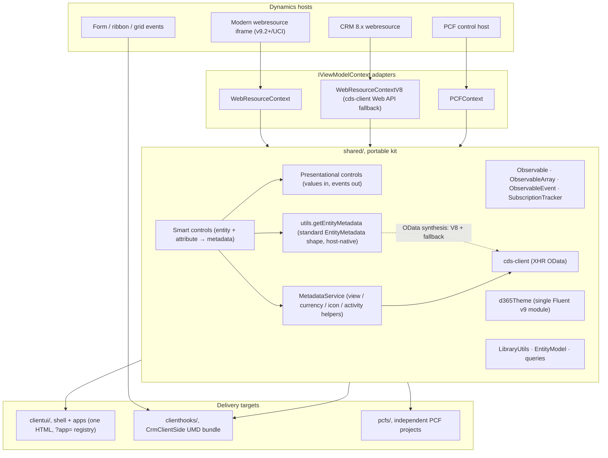

# Architecture Overview

A portable client-side kit for Dynamics 365 / Dataverse: one shared library
delivering native-looking (refreshed UCI / Fluent v9) UI to HTML webresources,
PCF controls, and form/ribbon/grid scripts.



Entity and attribute metadata mirrors the standard client API:
`context.utils.getEntityMetadata(entityName, attributes)` resolves the
platform's EntityMetadata shape, passed through untouched from the native
store on modern and PCF hosts (offline-capable) and synthesized from OData on
pre-v9. The under-documented `attributeDescriptor` members are decoded in one
place, `shared/metadata/attributeMetadataReads.ts`. `MetadataService` holds
only the kit helpers with no standard equivalent (saved views, currency,
entity icons, activity types); views and currency are data reads riding each
host's own Web API.

## The three-layer contract (non-negotiable)

| Layer | Knows CRM? | Queries? | Role |
|-------|-----------|----------|------|
| **Presentational** | Never, no context, no entity names | Never | Native-parity UI; renders supplied Observables; raises events |
| **Smart (metadata-aware)** | Yes, via `IViewModelContext` | Metadata + standard fetches | `entity` + `attribute` in, resolved presentational child out |
| **ViewModel** | Yes | Anything, merges, multi-query pipelines | Owns Observables and app rules; binds presentational controls |

Presentational purity is enforced by an ESLint `no-restricted-imports` rule
scoped to `shared/controls/presentational/`, not by convention.

The five kit terms used throughout (presentational, smart, ViewModel, Observable,
observe) are defined once in the [glossary](glossary.md).

## Repository topology

```text
shared/        # the portable kit (everything above)
clientui/      # webresource shell: bootstrap.tsx + registry.ts + apps/
clienthooks/   # ClientHook base + CrmClientSide registry (UMD)
pcfs/          # one folder per PCF project (own package.json each)
tests/         # unit/ (mirrors sources) + mocks/ + smoke/ + storybook/
docs/          # this folder
deployment/    # SPKL config + publish script
```

## Boot flow (webresource)

`clientui/bootstrap.tsx` reads top to bottom: find `#container` → parse
`?app=`/`data` → poll for Xrm (visible timeout error) → auto-detect modern vs
legacy adapter → registry lookup → render app inside `FluentProvider` +
`ViewModelContextProvider` (a full-page launch, marked `fullPage` by
`openClientUI`, gets the shell's own Back bar above a bounded scrolling app
region on the web client) → unmount on `pagehide` (not `beforeunload`, which
browsers deprioritize and which blocks the back/forward cache).

### One bundle, and the app manifest as the size lever

The shell ships as ONE script webresource on purpose: a single stable artifact
name is what the deploy mapping, the cache-busting HTML entry, and the local
autoresponder dev loop all key on. The cost of that choice is that the bundle
carries every registered app: the full ten-sample shell builds to roughly 890 KB
minified, while a shell trimmed to just the template and the samples hub builds
to roughly 425 KB. The apps are registered in one manifest,
`clientui/apps/index.ts`, one import line per app, and deleting a line removes
that app's code from the bundle entirely. When you fork the kit, trim the
manifest to the apps you actually ship; that, not code-splitting, is the
intended way to keep the bundle proportional to your deployment.

## Host parity

`IViewModelContext` mirrors the commonly-used native Xrm surface, so a
consumer rarely has to break out of the contract to reach a platform
capability. The bar is deliberately "commonly used", not exhaustive: the
obscure tail of the Xrm API is out of scope, and some hosts lack whole
capabilities (the PCF host has no native lookup dialog; the CRM 8.x adapter
rejects modern-only calls with readable errors). The host gaps are documented
where they bite, in [gotchas](gotchas.md). Within the mirrored surface, each
adapted area threads every native parameter through to the host call:

- **navigation**: `openForm` (convenience `(entity, id?)` plus the full
  `entityFormOptions` + `formParameters`), `openAlertDialog`/`openConfirmDialog`
  (full strings + dialog size), `openUrl` size options, `openWebResource`
  `openInNewWindow`, and the complete `navigateTo` page-input union.
- **webAPI**: CRUD with `{ entityType, id }` write results, the ergonomic
  `executeAction`/`executeClassicWorkflow`, and the generic `execute`/`executeMultiple`
  request-object contract.
- **client / device / utility**: `isNetworkAvailable`, the native device option
  fields, optional `getAllowedStatusTransitions` state code, and
  `getEntityMetadata` mirrored 1:1 from where the platform puts it
  (`Xrm.Utility` / PCF `context.utils`), resolving the standard EntityMetadata
  shape on every host.
- **globalContext**: organization and user settings, version, `prependOrgName`,
  and current-app metadata.
- **formContext**: the full form object model (`data`, `ui`, attributes,
  controls, tabs, sections, BPF process), built once by
  `formContextSurface.buildFormContext`. `formAccess` is a small wrapper over it.

One shared builder backs each area across all three hosts. The modern
(`WebResourceContext`) and PCF (`PCFContext`) hosts delegate to the native
calls; the legacy `WebResourceContextV8` maps the subset CRM 8.x exposes and
rejects what it cannot do with a clear "not supported on the CRM 8.x host"
error rather than silently doing nothing.

For the non-obvious bits (which Web API call routes to the native host vs
cds-client, `executeAction` vs `execute`, V8 rejections), see
[gotchas.md](gotchas.md).
