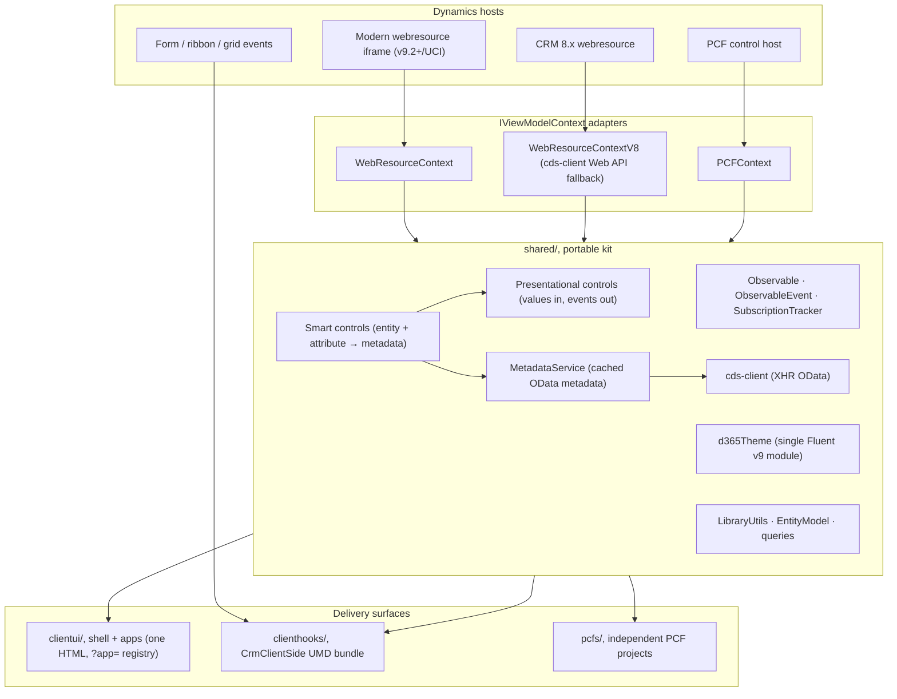

# Architecture Overview

A portable client-side kit for Dynamics 365 / Dataverse: one shared library
delivering native-looking (refreshed UCI / Fluent v9) UI to HTML webresources,
PCF controls, and form/ribbon/grid scripts.



## The three-layer contract (§5.2 of the spec, non-negotiable)

| Layer | Knows CRM? | Queries? | Role |
|-------|-----------|----------|------|
| **Presentational** | Never, no context, no entity names | Never | Native-parity UI; renders supplied Observables; raises events |
| **Smart (metadata-aware)** | Yes, via `IViewModelContext` | Metadata + standard fetches | `entity` + `attribute` in, resolved presentational child out |
| **ViewModel** | Yes | Anything, merges, multi-query pipelines | Owns Observables and app rules; binds presentational controls |

Presentational purity is enforced by an ESLint `no-restricted-imports` rule
scoped to `shared/controls/presentational/`, not by convention.

## Repository topology

```text
shared/        # the portable kit (everything above)
clientui/      # webresource shell: bootstrap.tsx + registry.ts + apps/
clienthooks/   # ClientHook base + CrmClientSide registry (UMD)
pcfs/          # one folder per PCF project (own package.json each)
tests/         # unit/ (mirrors sources) + mocks/ + smoke/ + storybook/
docs/          # this folder
deployment/    # SPKL config + publish script
```

## Boot flow (webresource)

`clientui/bootstrap.tsx` reads top to bottom: find `#container` → parse
`?app=`/`data` → poll for Xrm (visible timeout error) → auto-detect modern vs
legacy adapter → registry lookup → render app inside `FluentProvider` +
`ViewModelContextProvider` → unmount on `beforeunload`.
