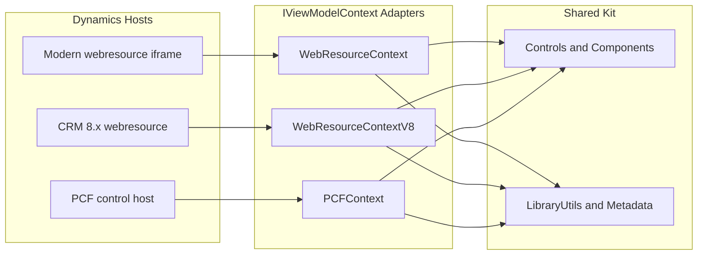
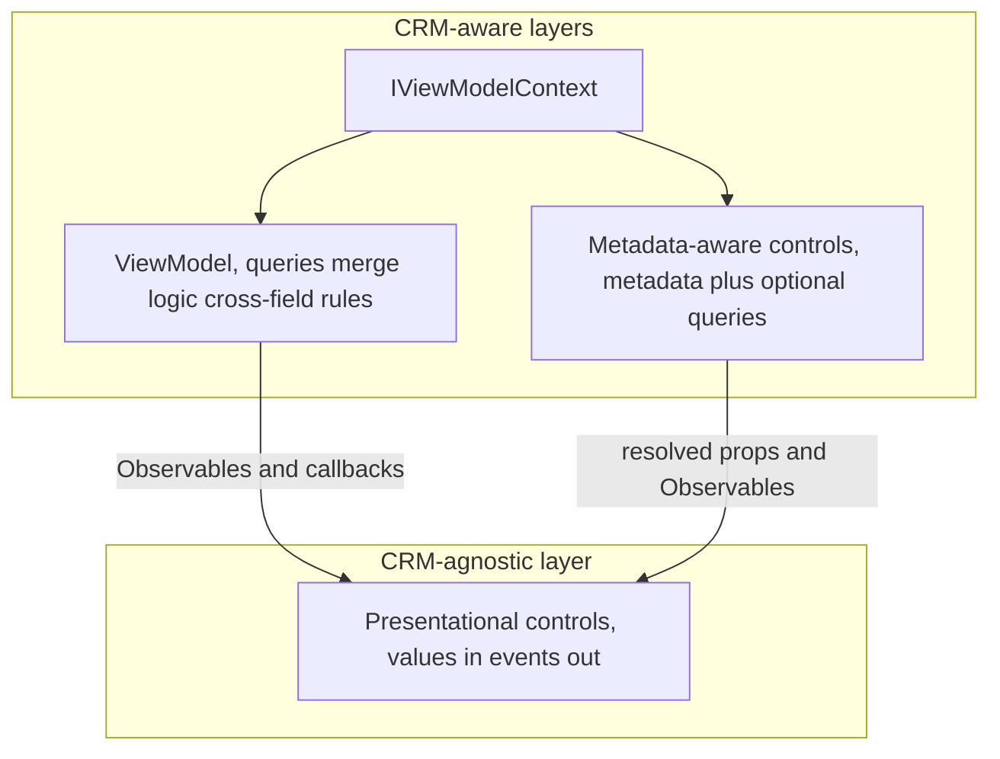
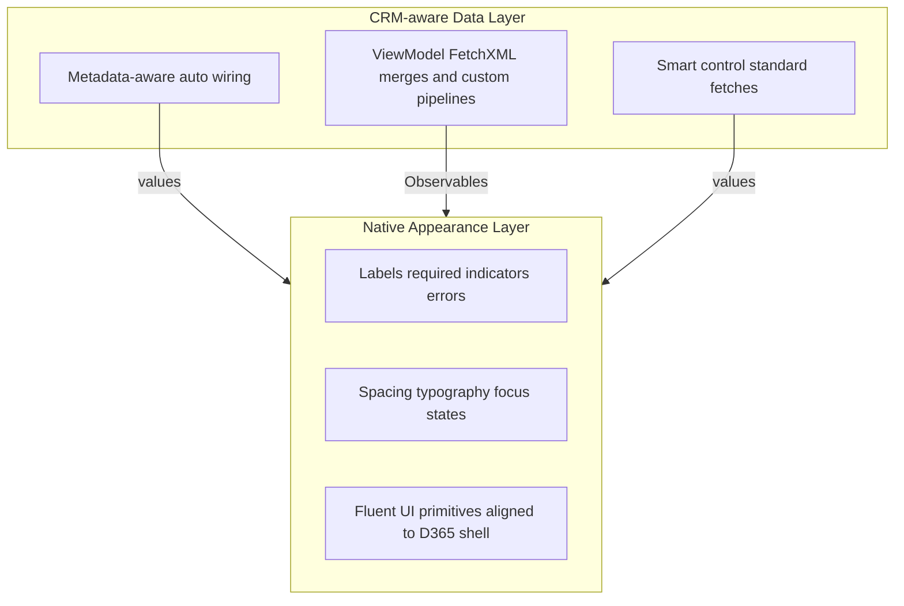
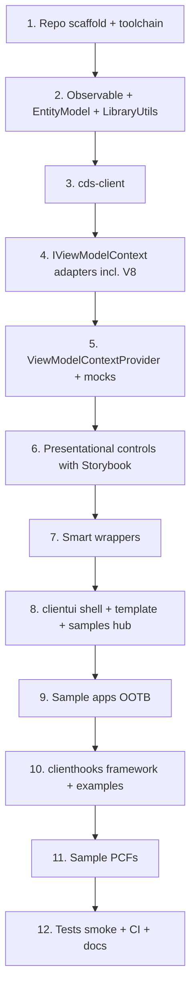

# Dynamics 365 Client-Side UI Kit, Greenfield Rebuild Specification

This is the design specification for the kit. It defines **what to build, why, and how to think about it**, not specific APIs, file contents, or technology choices beyond the stated constraints.

This specification is **fully self-contained**: every contract it must honor is stated in this document.

---

## 1. Mission and Design Philosophy

### 1.0 Lineage, SparkleXrm and the UCI gap

This kit is the **spiritual successor** to [Scott Durow's SparkleXrm](https://github.com/scottdurow/SparkleXrm), not a port or reimplementation of it.


| SparkleXrm (historical) | This kit (intent) |
| -------------------------------------------------- | ----------------------------------------------------------------------------------------------- |
| ScriptSharp → JavaScript | React + TypeScript |
| Pre-UCI / classic CRM visual language | **Unified Interface (model-driven app) native look and feel** |
| Metadata-driven controls for custom webresource UI | Same goal: declarative, metadata-aware building blocks, **entity + attribute ≈ form designer** |
| Shared components across custom HTML pages | Shared components across **webresources, PCFs, and client scripts** |
| Active maintenance stopped; UCI never adopted | Explicitly targets UCI parity as a first-class requirement |


**Why a successor (context for design decisions):** SparkleXrm pioneered metadata-driven controls for custom CRM UI, but it stopped at the pre-UCI visual language and is no longer maintained. This kit carries the same idea forward on a modern React + Fluent v9 stack with UCI fidelity: CRM developers should compose custom UI from **metadata-smart controls** that feel native, not from raw Fluent widgets and hand-wired FetchXML.

**What to carry forward from SparkleXrm's philosophy:**

- Controls that **know about Dataverse metadata** so apps stay thin
- Reusable blocks for grids, lookups, option sets, and forms outside the standard form renderer
- One library usable across multiple delivery surfaces (SparkleXrm: webresources; this kit: webresources + PCF + hooks)
- Developer ergonomics closer to **configuring a form** than to building a SPA

**What to leave behind:**

- ScriptSharp toolchain and its generated-code patterns
- Classic CRM chrome and pre-UCI styling
- Dependency on an unmaintained external package
- Any assumption that the kit should mirror SparkleXrm's API surface, learn from the intent, not the implementation

The native-shell / flexible-core split and the metadata-aware "code block" model in this spec are deliberate answers to what SparkleXrm got right (metadata-driven composition) and what it never finished (UCI fidelity, modern host coverage including PCF).

### 1.1 Purpose

Build a **portable client-side kit** for Microsoft Dynamics 365 / Dataverse customization that lets CRM developers (who are often not full-time React engineers) ship consistent UI across:

- **HTML webresources** (React apps hosted in model-driven forms and standalone pages)
- **PCF controls** (field and grid controls in unified interface)
- **Client-side scripts** (form, ribbon, and editable-grid event handlers)
- **Future option**: lightweight React popups launched from client scripts using the same building blocks (design for this possibility; do not over-build v1)

### 1.2 Core beliefs (non-negotiable)


| Belief | Rationale |
| ---------------------------------------------------------- | ------------------------------------------------------------------------------------------------------------------------------------------------------------------------------------------------------------------------------------------------------------------------------------------------------------------------------------------ |
| **Observables over React state for control data** | Most D365 developers understand subscribe/update patterns more easily than hooks, context composition, and render-prop chains. Hosts own state; controls react to it. |
| **Class components are first-class** | PCF roots, ViewModels, and many controls should remain class-based for readability in CRM teams. Hooks are allowed sparingly where they clearly reduce complexity. |
| **Host-neutral smart components** | Metadata-aware controls use `IViewModelContext` and run in webresource iframes, PCFs, and (eventually) script-launched popups without rewriting CRM logic. |
| **Strict presentational purity** | **Presentational** controls are **CRM-agnostic**: supplied values and callbacks only, no queries, no `IViewModelContext`, no metadata, no Dataverse concepts in their public API. Smart controls and ViewModels own all CRM I/O and delegate to presentational children. |
| **Obvious folder structure beats clever abstraction** | A new developer should find "where apps live", "where hooks live", and "where shared controls live" in under 60 seconds. |
| **Native shell, flexible core** | Controls must be visually indistinguishable from native model-driven UI, but functionally unconstrained, used precisely when native controls cannot do the job (merged query grids, multi-entity activity lists, custom lookup filtering, etc.). Appearance follows D365; data and behavior follow the developer's intent. |
| **Metadata-aware controls are declarative code blocks** | Smart controls should drop into a View with a handful of parameters (entity, attribute, view, label override, disabled), the same mental model as adding a field to a D365 form in the form designer, except expressed as React. The control owns metadata resolution and wiring; the app owns layout and composition. |
| **Native D365 visual fidelity is a first-class goal** | Earlier D365 customization often prioritized function over form. This kit targets parity with the Unified Interface **as it looks today**, the refreshed model-driven visual language built on Fluent UI v9, not the classic or v7/v8-era look. |
| **Close enough to ship in a day** | The kit exists to defeat the usual false choice: cram the requirement into standard D365 configuration, or spend a week on a clunky POC. Metadata-aware blocks + native-looking presentational controls should make **~1-day delivery** realistic for requirements that are 99% standard but need code-level control. |
| **MVVM for intermittent React, not hooks for daily React** | Most D365 projects ship **10–20 webresources/PCFs total**, not continuous React products. Without daily reps, hooks and modern composition become **re-learning tax**, two days to regain mindset for a minor change. View + ViewModel + Observables optimizes for **come-back-and-fix-it** maintenance, not React conference aesthetics. |
| **Prompt-friendly, citizen-dev legible** | Metadata-aware blocks and form-layout Views are easy for **coding agents to generate** and for **citizen developers to read after prompting**, aligned with Power Platform's React-generation direction and a post–Power Fx model-driven world. |


### 1.3 When to use kit controls vs native platform controls

The kit is **not only for exotic UI**. Its highest-impact use case is the gap between "what the platform almost does" and "what the user actually needs", when the requirement is **99% native** but standard D365 leaves no clean path.

#### The problem this kit solves

In normal D365 development, when the standard doesn't allow **exactly** what is needed, teams face a bad tradeoff:


| Option | Outcome |
| ----------------------------------- | ----------------------------------------------------------------------------------------------------- |
| **Force it into standard config** | Requirement goes unfulfilled the way the user wants, workarounds, manual steps, or compromised UX |
| **Build a custom POC from scratch** | Often ~1 week for something clunky that still doesn't match UCI |
| **Use this kit** | Native-looking UI with code-level control, target **~1 day** for many "almost standard" requirements |


**Time-to-value:** The aim is to deliver in one day what would otherwise either not ship as the user wanted, or cost a week for a rough POC. The kit must preserve and amplify that time-to-value, not become a framework that takes longer to learn than building ad hoc.

#### Three reasons to reach for kit controls (not mutually exclusive)


| Reason | Example |
| ---------------------------------------------------- | ----------------------------------------------------------------------------------------------------------------------------------------------------------------------- |
| **1. Native host can't host what you need** | You need a subgrid-like grid **inside a webresource** with the same look as the form, but you cannot embed a standard CRM grid in HTML and drive it from your code |
| **2. Requirement is ~99% native, interaction isn't** | Saved-view grid with one custom row action, lookup with one extra filter step, optionset with dynamic option pruning, standard controls are close but not programmable |
| **3. Data model doesn't fit one native control** | Merged queries, multi-activity-type lists, cross-entity pickers, visually standard, data source non-standard |


#### Decision table


| Use native D365 | Use kit controls |
| ----------------------------------------- | ----------------------------------------------------------------------------------------- |
| Standard form fields on entity forms | Webresource/PCF UI where you need **native UX with programmatic control** |
| Subgrids on forms (no custom interaction) | Subgrid-**like** grids in webresources you can bind, refresh, and handle events from code |
| Simple subgrids bound to one relationship | Grids whose rows come from **merging multiple queries** or computed joins |
| Single-entity activity subgrids | Activity lists **spanning multiple activity types** with unified columns and sorting |
| Out-of-box lookup behavior | Lookups with custom search logic, saved-query overrides, or multi-step filtering |
| Read-only display on form | Custom selection trees, persona lists, relationship counters, search-and-pick flows |
| "Good enough" standard config | Requirements where users will notice the difference if you compromise |


#### Design implications

- **Metadata-aware controls are the fast path** when the field behavior is standard but the **host is React** (webresource), you get form-designer simplicity without rebuilding option lists, formats, or labels by hand.
- **ViewModel + presentational** is the surgical path when data is custom (merged queries, multi-activity lists), ViewModel fetches and supplies values; presentational keeps UCI appearance without knowing CRM exists.
- **Neither tier should look custom.** Users should not perceive a quality drop versus native UI. A week-long clunky POC is a failure mode this kit replaces; a one-day solution that looks native is the success mode.
- **Optimize for the "ahh, standard doesn't allow exactly that" moment**, APIs, samples, and docs should make the 99%-native case faster than the exotic case. Exotic merged grids matter; everyday "I need a grid in a webresource that behaves like the form" matters more.

### 1.4 What this is NOT

- Not a SparkleXrm port, fork, or API-compatible drop-in replacement
- Not a generic React component library divorced from D365
- Not a copy of any production app's entity-specific hooks or hardcoded GUIDs
- Not a hooks-first or "modern React SPA" framework, routing, global state managers, and composition patterns aimed at full-time frontend engineers are out of scope
- Not an opportunity to carry over refactor clutter, one-off migration scripts, or sample files superseded by Storybook

### 1.5 Architectural stance, MVVM for the D365 delivery cadence

This kit **deliberately** uses View + ViewModel + Observable rather than hooks-centric React. That is a product decision grounded in how D365 projects actually run, not a rejection of modern frontend practice in general.

#### The intermittent-React problem


| Reality on typical D365 projects | Consequence |
| -------------------------------------------------------------------------------------------- | ------------------------------------------------------------------------------------------------ |
| **10–20 custom UI surfaces** (webresources + PCFs) across a whole implementation | Nowhere near enough repetition to internalize hooks, effect dependencies, or context composition |
| UI work arrives in **bursts**, one webresource this month, a PCF tweak six months later | Every return visit pays a **mindset ramp-up** before the actual change |
| Team members are often **functional consultants or CRM devs**, not full-time React engineers | Hooks fluency is perishable; "read the docs again" is a recurring tax |
| A "minor change" should take **an hour**, not **two days** | Cognitive overhead of the *framework* must stay lower than the work itself |


**Hooks are the right default when you ship React daily.** They are the wrong onboarding cost when React is a occasional escape hatch from platform limits, which is exactly this library's use case.

#### Why ViewModel + Observable fits that cadence


| MVVM characteristic | Benefit for D365 teams |
| -------------------------------------------------------- | ------------------------------------------------------------------------------------------------------------------- |
| **ViewModel holds logic; View mostly declares controls** | Opening `CompanySearchViewModel.ts` tells you where data and rules live, same mental model as form scripts |
| **Observables = "when this changes, update"** | Maps to event-driven CRM thinking without learning hook rules of capture |
| **Class components with explicit lifecycle** | PCF roots and CRM event handlers are already class-shaped; fewer paradigm switches |
| **Metadata-aware controls minimize ViewModel code** | Smart blocks keep ViewModels thin for the 99%-native case; ViewModels grow mainly when behavior is genuinely custom |


#### Large ViewModels, acknowledged, managed

Production use **has** produced large ViewModels. That is an accepted tradeoff, not a surprise failure:

- **Prefer thin ViewModels** via metadata-aware controls and shared utilities, business logic that repeats belongs in `shared/`, not copied across apps
- **Large ViewModels are maintainable** when structure is consistent (load / bind / handlers / dispose) and AI-assisted refactoring is available, do not chase hook purity at the cost of delivery speed
- **Do not introduce a second state paradigm** (hooks in Views, Observables in ViewModels) without strong reason, inconsistency hurts intermittent developers more than a long ViewModel file
- **Client hooks and ViewModels serve different hosts**, avoid duplicating the same 400 lines in both; webresource logic stays in ViewModels, form ribbon/grid logic stays in clienthooks

#### What reviewers from a React background will dislike, and why it is acceptable

React-first engineers may find class components, `forceUpdate`, and MVVM dated. **That audience is not the primary user.** The primary user is the D365 developer who returns to one webresource twice a year and needs to ship by Friday.

The rebuild should document this stance plainly so future contributors do not "modernize" the Observable/MVVM model away during well-intentioned refactors.

### 1.6 Strategic vision, model-driven custom UI, citizen devs, and the post-PowerFx era

#### What this kit represents (philosophically)

For many model-driven D365 requirements, **this is the product Microsoft should have shipped** instead of pushing teams toward canvas apps: native Unified Interface look-and-feel, real Dataverse metadata, programmatic control, without leaving the model-driven app context.

Canvas apps solved citizen development with **Power Fx and a parallel runtime**. Model-driven apps already have entities, forms, views, security, and metadata. The gap was always **custom UI that still feels native** when configuration hits its limit. This kit fills that gap with **React + metadata-aware blocks**, not a second app paradigm.

#### Alignment with Power Platform's direction

Microsoft is moving toward **coding agents and prompt-driven generation of React** for Power Platform (canvas evolving toward generated code rather than low-code formulas). **Power Fx was a detour** for teams whose data and UX already live in model-driven Dataverse, a proprietary language and runtime when the platform already speaks entities, attributes, and views.

This kit is **aligned with a React-output future**:


| Power Platform trend | This kit's position |
| ---------------------------------------------------- | ------------------------------------------------------------------------------------------------------------------------------------------------------ |
| Agents generate React, not only Power Fx | Views composed of declarative metadata-aware controls are **easy to generate correctly**, `entity` + `attribute` is a small, well-typed prompt target |
| Citizen devs start with prompts, may later read code | MVVM + form-designer-like Views are **more legible after generation** than hook chains, open the View, see fields; open the ViewModel, see logic |
| Low-code / pro-code convergence | Metadata-aware controls **are** the convergence layer, configuration semantics in code |


The kit does not try to replace Power Apps canvas. It is the **code-first, model-driven-native** path for teams who were always poorly served by "build a canvas app beside your model-driven app."

#### Citizen developer + AI prompting workflow (design for this)

Assume an increasing share of apps will be **bootstrapped by Power Platform coding agents or general AI**, then touched up by humans:


**Design the framework so agent-generated output is good enough to ship and clear enough to follow:**


| Property | Why it matters for prompt + citizen dev |
| ------------------------------------------------ | ------------------------------------------------------------------------------------------------------------------------------------- |
| **Metadata-aware controls with few parameters** | Agents reliably produce `<SmartLookup entity="account" attribute="parentaccountid" />`-shaped code; fewer hallucinated FetchXML blobs |
| **Views that read like form layouts** | Generated JSX is inspectable, citizen devs can map lines to form designer concepts |
| **Predictable app folder structure** | Agents and humans find `app.ts`, `*View.tsx`, `*ViewModel.ts` without project-specific conventions |
| **Thin shell, obvious registry** | Less agent confusion about bootstrap vs app code |
| **Consistent ViewModel shape** | Generated ViewModels follow one template; humans know where handlers and Observables live |
| **OOTB sample apps as prompt few-shot examples** | `sample-company-search` and `template` are reference material for agents and humans |


**Human follow-up is a success scenario, not a failure.** The goal is not "citizen dev never reads code." The goal is **prompt → working native-looking UI in hours**, then **optional comprehension** when requirements change, without a two-day hooks ramp-up.

#### Implications for the rebuild

- **Readability beats cleverness** in samples and generated patterns, if an agent would struggle to mimic it, simplify the pattern
- **Prefer smart controls over hand-wired presentational** in template and primary samples, that's what citizen devs and agents should default to
- **Document "prompt-friendly patterns"** in `docs/`, what to ask an agent for, which sample to point it at, which controls need presentational tier
- **Do not optimize for Power Fx interoperability**, this kit is not a Power Fx host; it is React on Dataverse metadata

### 1.7 Technology baseline (deliberate, not inherited)

Older D365 client stacks (React 16.8, Fluent v7/`@uifabric`, dated `pcf-scripts`/TypeScript, `ReactDOM.render`) tend to be **accumulated, not chosen**. This kit pins its foundation deliberately:


| Concern | Decision | Rationale |
| --------------- | ------------------------------------------------------------------------------------------------------------------------------------------------------- | ------------------------------------------------------------------------------------------------------------------------------------------------------------------------------------------------------------------------------------------------------------------ |
| **UI library** | **Fluent UI v9**, plus official compat packages where a control only exists there (e.g. date picker) | "Native look" in 2026 means the refreshed model-driven UCI visual language, which is Fluent v9 design. Do **not** mix v8 and v9 theming in shipped controls; if v9 genuinely lacks a needed primitive, build a thin token-styled primitive instead of importing v8 |
| **React** | **18+**, `createRoot`/`root.unmount` everywhere (shell, PCFs, future popups) | The old `ReactDOM.render` API is deprecated; no reason to carry it into a greenfield |
| **TypeScript** | **One current version repo-wide**, strict | A split TypeScript setup (TS 6 / TS 4.9) is a common workaround for a years-old `pcf-scripts` pin, not a design decision |
| **PCF tooling** | **Latest `pcf-scripts`**; PCFs bundle their own React and Fluent in v1 | Platform libraries (shared React/Fluent from the host) are a future optimization, note in docs, don't build now |
| **Browsers** | **Modern evergreen only, even for CRM 8.x hosts** | "Legacy support" means old *server APIs*, not old browsers. No IE11 targets, no polyfill bloat; ES2022+ output is fine |
| **Bundler** | Any that produces the required artifacts (single-file global bundle for clienthooks, single-bundle app for clientui); Webpack 5 is proven, not mandated | Artifact shape is the contract, not the tool |


**Conditional fallback:** if the latest `pcf-scripts` lags the kit's TypeScript version, constrain `shared/` to the lowest commonly supported syntax and verify by building all PCFs in CI whenever `shared/` changes, do **not** fork the codebase into two toolchains by default.

---

## 2. Repository Topology

Organize the **entire repo** at the root level by **delivery surface**, not by an opaque `src/` monolith name. Shared code is a peer, not buried.

```text
Root/
├── shared/ # Portable kit, the source of truth
├── clientui/ # Unified HTML webresource shell + apps
├── clienthooks/ # Form / ribbon / grid script bundle
├── pcfs/ # Independent PCF projects (one folder each)
├── tests/ # Mirrors shared/, clientui/, clienthooks/, pcfs/ structure
├── docs/ # Human-facing product docs only
├── deployment/ # SPKL / publish helpers
└── ci/ # Pipeline definition (or root-level azure-pipelines.yml)
```

### 2.1 Why this layout

This layout makes **PCFs**, **clienthooks**, **clientui**, and **shared** top-level concerns instead of burying them under a single source tree. A developer opening the repo should immediately see **four delivery channels** and one **shared library**.

### 2.2 `shared/`, portable kit only

Contains everything reusable across hosts. **No production entity business logic.** No webresource app ViewModels. No PCF manifest wiring.

Conceptual areas (organize folders to reflect these boundaries clearly):


| Area | Responsibility |
| ------------------ | ------------------------------------------------------------------------------------------------------------------------------------------------------------------------------------------- |
| **Context** | `IViewModelContext` contract; adapters for modern webresource host, legacy CRM 8.x host, and PCF |
| **Reactivity** | `Observable`, `ObservableEvent`, minimal pub/sub for host-owned values |
| **Data access** | `cds-client`, standalone Dataverse Web API client for external environments and legacy fallback |
| **CRM utilities** | Cross-host helpers: OData formatting, form lock/unlock, show/hide/disable on form or editable grid, webresource data-param parsing, entity reference types |
| **Metadata** | Option sets, number precision, date format, attribute metadata, cached, context-mediated |
| **Controls** | **Presentational** (CRM-agnostic; values/events only) and **smart** (context + metadata + queries → delegates to presentational) per field type |
| **Components** | Composites built from controls (search results, contact cards, input forms, tooltips, persona lists, selection trees with domain logic, etc.) |
| **Styles / theme** | **Single theme module**: D365-aligned Fluent v9 theme/tokens (typography, spacing, neutrals) defined once; shared icon exports (v9 SVG icons need no global init); shimmer/loading patterns |
| **Queries** | Reusable FetchXML / query fragments (OOTB entities only in samples) |


**Naming:** Use neutral, descriptive names (`control-optionset`, `component-search-results`). Export surface should be discoverable from a single barrel entry point.

### 2.3 `clientui/`, webresource shell and apps


| Sub-area | Responsibility |
| ---------------- | ------------------------------------------------------------------------------ |
| **Shell entry** | Minimal bootstrap: container, wait for Xrm, create context, select app, render |
| **App registry** | One obvious file mapping app keys → app modules |
| **apps/** | One folder per app; each app is self-contained |
| **html/** | Single `clientui.html` template loading one JS bundle |


**Per-app folder convention** (keep flat and predictable):

```text
clientui/apps/<app-key>/
├── app.ts # Thin registration, how this app plugs into the shell
├── <Name>View.tsx # React view (renders controls)
└── <Name>ViewModel.ts # Owns Observables, calls webAPI/metadata (optional for trivial apps)
```

### 2.4 `clienthooks/`, script bundle

Recommended structure:

```text
clienthooks/
├── index.ts # Exports global registry (e.g. CrmClientSide)
├── shared/
│ └── ClientHook.ts # Abstract base + registry types
├── form/
├── ribbon/
├── grid/
└── common/ # Cross-entity helpers usable by multiple hooks
```

**v1 delivers the framework plus OOTB examples only**, e.g. a sample `Account` or `Opportunity` form hook demonstrating field manipulation via `LibraryUtils`, a ribbon command opening the unified webresource shell, and a grid hook demonstrating editable-grid field lock. **Do not include production-specific forms** (entity-specific form scripts, hardcoded workflow GUIDs, etc.).

### 2.5 `pcfs/`, independent PCF projects

Each control is its own package with manifest, solution folder, and build tooling. PCFs **import shared source via relative path or path alias** into `../shared/`, built with the latest `pcf-scripts` on the same TypeScript version as the kit.

**v1 sample PCFs** (illustrate both integration patterns):

1. **Presentational via PCF root**, PCF root uses `PCFContext` for any CRM I/O, owns Observables, renders **CRM-agnostic** presentational control with supplied values (optionset values from PCF parameters)
2. **Smart + provider**, PCF root wraps `ViewModelContextProvider`, renders metadata-aware component which internally fetches and delegates to presentational (datepicker with locale, tooltip with attribute metadata)

Do not ship all ten current PCFs; ship enough to prove the patterns.

### 2.6 `tests/`, mirrored structure

```text
tests/
├── unit/shared/... # mirrors shared/
├── unit/clientui/... # mirrors clientui/
├── unit/clienthooks/... # mirrors clienthooks/
├── mocks/ # Xrm mocks (modern + legacy)
├── smoke/ # jsdom bundle smoke tests
└── storybook/ # OR storybook at root, presentational controls only
```

**Convention:** test and story paths mirror production paths after the top-level package name. Component source folders contain **source only**, no co-located `*.test.tsx` or `*.stories.tsx`.

### 2.7 Package management

- **One npm package at the repo root** covers `shared/`, `clientui/`, and `clienthooks/`, they are folders of a single TypeScript project, not separate packages. No workspaces, no internal publishing.
- **Each PCF is its own package** (a `pcf-scripts` requirement), importing `shared/` source directly.
- `shared/` is consumed **as source** everywhere; nothing is published to a registry in v1.

---

## 3. Host Abstraction, `IViewModelContext`

### 3.1 Contract intent

A single interface that exposes everything shared React code needs from the host:

- Client URL and global context (user, org, version)
- Navigation (open form, open webresource, dialogs)
- Web API (CRUD, FetchXML retrieve, custom actions, workflows where supported)
- Metadata service (option sets, attribute definitions, date/number formats)
- Form context when hosted on a form (entity, record id, attributes)
- Utility (alert, confirm, getResourceString if needed)

**Smart controls, ViewModels, client hooks, and PCF roots** use `IViewModelContext` (or `PCFContext`) for all CRM access. They **must not** reach directly into global `Xrm.Page`, raw `GetGlobalContext`, or `parent.Xrm`.

**Presentational controls never receive or import context**, they are host-agnostic UI primitives usable in Storybook with zero CRM mocks.

### 3.2 Three adapters (all first-class in v1)




| Adapter | When | Legacy behavior |
| ------------------------ | -------------------------------- | --------------------------------------------------------------------------------------------------------------------------------------------------- |
| **WebResourceContext** | Model-driven apps, cloud, v9.2+ | Native `Xrm.Navigation`, `Xrm.WebApi`, `getGlobalContext` |
| **WebResourceContextV8** | CRM 8.x on-prem | Same contract; maps v9-style navigation calls to deprecated v8 APIs; **Web API falls back to `cds-client`** when native `Xrm.WebApi` is unavailable |
| **PCFContext** | PCF `ComponentFramework.Context` | Wraps PCF web API, mode, parameters, formatting |


**Factory:** `createWebResourceContext` auto-detects modern vs legacy at runtime. Used by both `clientui` bootstrap and `clienthooks` bundle initialization.

**React bridge:** `ViewModelContextProvider` wraps app/PCF render trees. Class components use `contextType` + `declare context` under strict TypeScript. ViewModels may still receive `IViewModelContext` in constructors, both patterns coexist intentionally.

### 3.3 Xrm availability timing


| Consumer | Strategy |
| --------------------- | ---------------------------------------------------------------------------------------------------------------------------------- |
| **Webresource shell** | Poll parent/current window for Xrm with timeout; fail with visible error message in container |
| **Client hooks** | Context created at module load, document that CRM must load script after Xrm is available (standard library webresource ordering) |


These differences are intentional; do not unify them in ways that obscure the behavior.

---

## 4. Observable Pattern, State Ownership Contract

### 4.1 What Observables are for

- ViewModel state shared across multiple controls
- Runtime-changing values (option lists loaded async, lookup results, grid rows)
- Fire-and-forget events (`ObservableEvent` for refresh commands, toolbar clicks)
- Bridges between PCF input properties and React controls

### 4.2 Ownership rules


| Owner | Responsibility |
| --------------------------------------------- | ----------------------------------------------------------------------------------------------------- |
| **Host** (ViewModel, smart wrapper, PCF root) | Creates `Observable` instances; sets values after async work |
| **Presentational control** | Subscribes in constructor; calls `forceUpdate` on change; **does not** mirror into React `useState` |
| **Smart wrapper** | Loads metadata; writes into host-owned observables; renders presentational child |


**Option set exemplar contract:** Both `values` (available options) and `selectedValue` are host-owned observables. Smart wrapper populates `values` after metadata fetch; presentational control subscribes to both.

### 4.3 Lifecycle safety

- Unsubscribe in `componentWillUnmount` or PCF `destroy` when the Observable can outlive the component
- Guard async callbacks with a disposed flag before mutating observables or calling `forceUpdate`
- Never create new Observables inside `render` unless intentionally ephemeral
- **Bake the discipline into structure:** provide a small subscription helper or base class (tracked subscriptions, auto-unsubscribe on unmount/`destroy`, disposed flag) so these safety rules are enforced by code, not by memory. These safety rules are easy to leave as tribal knowledge; the kit should make the wrong thing hard to write instead

**Do not replace this pattern with global state libraries, Redux, or hook-heavy composition** unless a specific component has an exceptional need, and that should be rare and documented.

### 4.4 ViewModel conventions (keep intermittent devs productive)

ViewModels exist so a developer returning after months can orient in one file:


| Convention | Intent |
| ------------------------ | ---------------------------------------------------------------------------------------------------------- |
| **Constructor** | Receives `IViewModelContext`; creates Observables; kicks initial load |
| **Public Observables** | What the View binds to, named for CRM concepts (`selectedAccount`, `gridRows`, `isLoading`) |
| **Handler methods** | `onSearch`, `onRowSelected`, wired explicitly in View, not anonymous inline closures scattered everywhere |
| **Dispose / guard flag** | Async-safe teardown; mirror PCF `destroy` discipline |
| **No UI markup** | ViewModel never imports Fluent components |


**Size guidance:** Metadata-aware controls exist precisely to prevent ViewModels from reimplementing metadata wiring. If a ViewModel is growing large, first ask whether another smart control or shared helper should absorb logic, not whether to rewrite in hooks.

---

## 5. Component Architecture

### 5.1 Controls vs components


| Layer | Scope | Examples |
| ----------------------------- | ----------------------------------------------------------- | ----------------------------------------------------------------------------------------------------------------------------------------- |
| **Controls (presentational)** | CRM-agnostic UI primitive, one field or atomic widget | Text field, optionset, lookup result list, date picker, numeric input, checkbox, grid table, waiting spinner, **no context, no queries** |
| **Controls (smart)** | Metadata/query wrapper delegating to presentational | Smart lookup, smart optionset, smart datepicker, read-only view grid, **uses `IViewModelContext`** |
| **Components** | Composites, smart orchestration + presentational rendering | Search results (smart fetch + presentational cards), business card, input form, address doctor pipeline |


### 5.2 Three layers, presentational, smart, ViewModel




| Layer | Knows CRM? | Executes queries? | Responsibility |
| ---------------------------- | ------------------------------------------------ | ------------------------------------------------------ | ----------------------------------------------------------------------------------------------------------------- |
| **Presentational** | **No**, no context, no entity names, no Web API | **Never** | Native-parity UI; subscribes to **supplied** Observables; raises events (`onChange`, `onSearch`, `onRowSelected`) |
| **Metadata-aware ("smart")** | Yes, uses `IViewModelContext` | Yes, when needed for metadata or standard data loading | Resolve field config from Dataverse; run standard fetches; pass **values** into presentational child |
| **ViewModel** | Yes | Yes, custom merges, multi-query grids, app rules | Own Observables; execute non-standard pipelines; bind presentational controls **or** compose smart controls |


#### Presentational controls, hard rules (non-negotiable)

- **No `IViewModelContext`**, `ViewModelContext`, `PCFContext`, or `Xrm`, not even optionally
- **No FetchXML, OData, saved-query ids, or entity logical names** in props
- **No metadata helpers**, no attribute type lookups
- **Supplied values only**, rows, options, labels, formats, column defs, selected value, via Observables and plain props
- **Events out**, parent, smart layer, or ViewModel decides what to fetch in response
- **Storybook runs with zero CRM mocks**, fixture data only
- **Enforced by lint, not just review**, a restricted-imports rule scoped to presentational folders forbids importing Context, Metadata, `cds-client`, or `LibraryUtils`

If a control calls `webAPI` when the user types in a lookup box, that is a **smart control** or **ViewModel** concern. The presentational lookup renders **supplied results** and emits **search text changed**.

#### Metadata-aware controls

Smart controls accept a **small declarative config** (entity, attribute, view id, optional overrides) plus value Observables, then load metadata and/or execute standard queries via context, and render the **presentational** child with resolved values.

### 5.3 The "form configuration" mental model for metadata-aware controls

Metadata-aware controls are the primary way CRM developers should add standard fields to webresource Views. The goal is **form-designer ergonomics in code**:


| Form designer concept | Metadata-aware control equivalent |
| -------------------------------- | -------------------------------------------------------- |
| Add field to form | Drop component in JSX with `entity` + `attribute` |
| Field label / required / visible | Optional override props; defaults from metadata |
| Option set values | Auto-loaded from global or local option set |
| Lookup target entity and view | Resolved from attribute metadata; optional view override |
| Number precision and min/max | Resolved from attribute metadata |
| Date format | Resolved from user locale + attribute behavior |


**What the developer should NOT need to do for standard fields:**

- Manually fetch and map option set integers to labels
- Look up attribute type to decide which presentational control to render
- Configure decimal precision, currency symbol, or date format by hand
- Build FetchXML for a simple saved-view grid when a view id suffices

**What the developer handles in the ViewModel (not in presentational controls):**

- Merging results from multiple FetchXML queries into one grid, ViewModel fetches, merges, sets row Observable; presentational grid **displays supplied rows**
- Combining `task`, `phonecall`, `appointment` into one activity list, ViewModel normalizes and supplies rows
- Custom filter logic before lookup search, ViewModel handles `onSearch` from presentational lookup, fetches, updates results Observable
- Column templates, row actions, command bar, presentational renders; ViewModel/smart wires handlers

**Composition rule:** A typical app View is mostly **metadata-aware code blocks** for standard fields, plus **ViewModel-bound presentational controls** where data is custom (merged grids, multi-query lists). Presentational controls never appear with entity names in the View, only Observables and callbacks. Smart controls carry entity/attribute config.

### 5.4 Field-type coverage targets (v1 foundation)

**Standard types, aim for native visual parity:**

- Single-line text
- Multiline text
- Rich text (HTML editor), **deferred**: ship only if a maintained, Fluent v9-compatible editor integrates cleanly
- Option set (single select)
- Multi-select option set
- Lookup (single), including search-as-you-type and combo variants
- Lookup (multi)
- Date and time
- Whole number, decimal, floating point
- Currency
- Boolean (two-option toggle)

**Specialized controls (beyond native, the functional flexibility layer):**

These are the controls you reach for when native subgrids, lookups, or form fields cannot express the requirement. They must still **look native**.


| Control | Layer | Native limitation it addresses |
| ------------------------------------ | -------------------------------------------- | ----------------------------------------------------------------------------------------- |
| **Read-only query grid** | Presentational (displays supplied rows) | **ViewModel** merges multiple FetchXML results into one row Observable; grid looks native |
| **Read-only view grid** | Metadata-aware → presentational grid | Saved view in a webresource, one view id; smart layer fetches |
| **Unified activity list/grid** | ViewModel + presentational grid | Multiple activity types, ViewModel normalizes rows; presentational displays |
| **Selection tree** | Presentational (supplied tree nodes) | Hierarchical multi-select, ViewModel or smart loads nodes |
| **Location/territory tree** | Metadata-aware → presentational tree | Domain tree with entity-backed loading in smart layer |
| **Relationship counter** | Metadata-aware or ViewModel + presentational | Aggregated counts, fetch in CRM layer, display in presentational |
| **Custom persona list** | Presentational (supplied personas) | Custom layout, ViewModel supplies data |
| **Search command bar + result list** | Presentational + ViewModel/smart fetch | Search UX, presentational renders; CRM layer queries on `onSearch` |


**v1 sample priority:** Include at least one sample that demonstrates **merged multi-query grid** and one that demonstrates **multi-activity-type list**, these are the canonical "why not native" scenarios.

### 5.5 Native shell, flexible core, design strategy

Separate **appearance** from **data sourcing** in the architecture:




1. **Reference model-driven form rendering** for each field type, spacing, label placement, required indicator, validation error presentation, disabled and read-only appearance, focus rings
2. **Storybook as the visual contract**, every presentational control has stories for: empty, filled, disabled, read-only, error, required, and long-content overflow states
3. **Storybook "limitation bypass" stories**, merged grid with heterogeneous row sources; activity list with mixed `activitytypecode` values, visually identical to native grids/lists
4. **Side-by-side review workflow**, stories documented with "compare against native control X in model-driven app" checklist
5. **Avoid off-brand Fluent customization**, stock Fluent UI v9 controls themed through the single D365-aligned theme module; controls consume tokens, never hardcode colors
6. **Smart wrappers inherit presentational styling**, metadata loading shows consistent `WaitingMessage` / shimmer, not layout shift
7. **Presentational controls separate rendering from data**, column/row **rendering** (native look) vs row **supply** (ViewModel/smart via Observables); presentational never fetches
8. **Accessibility is part of native parity**, keyboard, focus, and ARIA behavior must match what Fluent v9 provides natively; custom wrappers must not break it
9. **No hardcoded user-facing strings in controls**, labels and messages are supplied via props or resolved (already localized) from metadata; English defaults exist only as dev-time fallbacks

### 5.6 PCF integration strategy

**One clear mounting approach**, prefer React tree rendering with `ViewModelContextProvider` over duplicate static `renderControl`/`destroyControl` helpers. If static helpers remain for specific PCF lifecycle edge cases, they must be thin wrappers around the same React element factory, not a parallel implementation path.

PCF roots own: input/output mapping, Observable bridges from PCF properties, React mount/unmount in `destroy`.

---

## 6. `cds-client`, External Dataverse Access

### 6.1 Purpose

A lightweight **XHR-based OData client** implementing the same conceptual surface as `ComponentFramework.WebApi` for scenarios where:

- Native `Xrm.WebApi` is unavailable (CRM 8.0 floor)
- Code must call a **different Dataverse environment** than the hosting session (external URL + version in constructor)
- Custom actions and workflow execution need a standalone client

**Auth scope (v1), important:** `cds-client` rides **ambient credentials only**: the same-origin CRM session, or integrated Windows auth for on-prem orgs reachable from the user's browser (the historical "external environment" scenario). **Token acquisition (OAuth) and cross-origin cloud orgs are out of scope**, do not build an auth flow. Document this boundary prominently so consumers don't assume arbitrary cross-org reach.

### 6.2 Capabilities to support

- Create, update, delete, retrieve single record
- Retrieve multiple via FetchXML query string
- Long FetchXML batch fallback when query exceeds platform URL limits
- Execute custom actions
- Execute workflows (where still relevant for legacy)

### 6.3 Usage boundaries


| Use context | Preferred API |
| ------------------------------------------ | ---------------------------------------------------------------- |
| Inside webresource/PCF against current org | `context.webAPI` |
| Legacy host without native Web API | `WebResourceContextV8` → `cds-client` fallback |
| Cross-org or explicit version | Direct `cds-client` instantiation |
| Ribbon workflow with known id | Acceptable as direct `cds-client` call if not exposed on context |


**Known limitation to document, not hide:** v1 `retrieveMultiple` is FetchXML-oriented; OData `$filter` query strings are out of scope unless added with clear naming.

### 6.4 Consolidation intent

Avoid the current pattern of scattered `new ExternalWebApi({ clientUrl, webApiVersion: "v9.1" })` with hardcoded versions. Centralize version constants and document when to use context vs external client.

---

## 7. Webresource Shell, Simplicity Requirements

A webresource shell can easily grow into a small React framework, `bootstrap` → `Shell` → `IWebResourceApp` → `createReactApp` → `formRecord` → `queryString` spread across many files with overlapping responsibilities. **The kit must optimize for CRM developer comprehension over architectural purity.**

### 7.1 Shell responsibilities (and only these)

1. Find `#container` in the HTML webresource
2. Apply the kit theme once (Fluent v9 provider wrapping the app tree with the D365-aligned theme)
3. Parse app selection from query string (`?app=`) and/or CRM `data` JSON payload (`{"app":"..."}`)
4. Wait for Xrm in parent/current window (with timeout + user-visible error)
5. Call `createWebResourceContext`
6. Look up app in registry; render app inside `ViewModelContextProvider`
7. Handle window resize for full-viewport apps
8. Unmount on `beforeunload`

### 7.2 What "simpler" means in practice


| Keep | Simplify or avoid |
| ----------------------------------------------------------- | -------------------------------------------------------------------------- |
| Single HTML + single JS bundle | Per-app code splitting (defer to future) |
| App key registry in one obvious file | Deep factory hierarchies |
| `createReactApp`-style one-liner for 90% of apps | Multiple overlapping app contracts |
| Opt-in `RecordReady` wrapper for form-record-dependent apps | Shell-wide polling for every app |
| Linear boot flow readable top-to-bottom in one entry file | Indirection through many single-purpose modules unless each earns its keep |


### 7.3 App adapter contract

Apps are **render-only**. The shell calls `render(host)` and receives React nodes. No separate `mount`/`unmount` hooks on the app adapter, React owns lifecycle.

`host` provides: `context`, `params` (parsed query/data), `container` (root element).

**Standard app (majority):** registration helper wires View + `getProps(host)`.

**Custom app (minority):** manual adapter when the app must wrap with `RecordReady`, parse specialized `data` payload, or construct ViewModel before render.

### 7.4 `RecordReady` pattern

Some form-embedded apps need `formContext.data.entity.getId` before creating state, e.g. territory selector on a subform.

- **Indefinite wait** with `WaitingMessage`, no timeout unless explicitly requested later
- **Opt-in per app** in `app.ts`, not default shell behavior
- Search apps and standalone webresources render immediately

### 7.5 Anti-patterns to avoid (learned from current repo)

- Duplicate query/data parsers (`queryString` vs `LibraryUtils.getWebResourceDataParam`), **one canonical parser**
- Legacy per-app HTML files (`FSXBulkCreate.html`), **all apps go through unified `clientui.html?app=...`**
- Opening webresources from ribbon with old paths, sample ribbon hooks demonstrate unified URL pattern
- Monolithic `apps/index.ts` that imports every app with no grouping, acceptable for v1 single bundle, but structure imports clearly (comment blocks by category: samples, templates, production)

---

## 8. Client Hooks Framework

### 8.1 Delivery

Separate webpack bundle exposed as a **UMD global** (e.g. `CrmClientSide`) for registration in CRM form/ribbon/grid library web resources.

### 8.2 Registry shape

Entity-centric nesting matching current proven pattern:

```text
CrmClientSide.<EntityName>.Form.<handler>
CrmClientSide.<EntityName>.Ribbon.<handler>
CrmClientSide.<EntityName>.Grid.<handler>
```

Plus non-entity keys for reusable grid handlers (e.g. `LockedGrid`).

### 8.3 Base class intent

Abstract `ClientHook` holds `IViewModelContext` (or typed modern context). Concrete hooks implement CRM event signatures (`onLoad`, `onSave`, ribbon `command`, grid `onRecordSelect`, etc.) using `LibraryUtils` for field manipulation.

### 8.4 v1 examples (OOTB only)


| Example | Demonstrates |
| ------------------------------------------- | ---------------------------------------------------------------------- |
| **Form hook** on `account` or `opportunity` | `onLoad` field show/hide/disable via `LibraryUtils` |
| **Ribbon hook** | Enable rule or command opening `clientui.html?app=<sample>&data=...` |
| **Grid hook** | Editable grid, disable all columns on row select (LockedGrid pattern) |


### 8.5 Testing stance

Smoke tests and DI pattern verification, not exhaustive business logic coverage. Document that `clienthooks/` examples are **templates**, not portable kit.

---

## 9. `LibraryUtils` and Cross-Host Utilities

### 9.1 Intent

CRM developers should import one utility module for tasks they do today with copy-pasted Xrm snippets:

- Lock/unlock entire form or all except specified fields
- Show/hide/disable fields on **form or editable grid** (detect `formType`)
- Format OData values and build entity references
- Parse webresource `data` parameter
- Generate correlation IDs for batch boundaries
- Open unified webresource shell with app key and payload

### 9.2 Future-facing design

Structure utilities so a form script could someday open a React popup hosting the same controls, utilities should not assume they only run inside the hook bundle. Avoid tight coupling to the UMD global name.

---

## 10. Sample Apps and PCFs (v1 Content)

### 10.1 OOTB sample webresource apps

Use **standard Dataverse entities only** (`account`, `contact`, `opportunity`, `activitypointer`, etc.), no custom `new_`* tables.


| App | Purpose |
| ----------------------------- | ------------------------------------------------------------------------------------------------------------------------------------------------------------------------------------------------- |
| **template** | Minimal scaffold, new dev starting point |
| **samples hub** | Single webresource hosting a selector that swaps between sample apps (demonstrates dynamic app switching without separate deployments) |
| **sample-company-search** | **99%-native flagship**, saved-view grid and lookups in a webresource that look and behave like form controls, with code-level refresh/selection (the "can't embed a standard subgrid" scenario) |
| **sample-opportunity-search** | Composite filter form using nearly every control type, the "kitchen sink" demo |
| **sample-activities-grid** | **Multi-activity-type merged list**, tasks, phone calls, appointments in one native-looking grid with shared columns and sort |
| **sample-merged-grid** | **Multi-query merged grid**, rows from two or more FetchXML sources combined (canonical "native subgrid can't do this" demo) |
| **sample-territory-cascade** | Multi-lookup cascade + optionset |


Each sample has a **Storybook "dumb" counterpart** using presentational controls + fixture data, same layout, no live CRM.

**Sample tiering for onboarding:**


| Tier | Samples | Teaches |
| ------------------------- | ------------------------------------------------------- | ---------------------------------------------------------------- |
| **Everyday (start here)** | `template`, `sample-company-search` | Native-parity fields/grids in webresources; ~1-day delivery path |
| **Composition** | `sample-opportunity-search`, `sample-territory-cascade` | Multiple metadata-aware blocks in one View |
| **Exotic data** | `sample-merged-grid`, `sample-activities-grid` | Native look when data doesn't fit one native control |


### 10.1.1 Illustrative View composition (intent only)

A sample opportunity webresource View should read conceptually like a form layout, mostly declarative blocks, few presentational escape hatches:

- Metadata-aware option set, lookups, date, and currency fields for standard opportunity attributes
- Presentational merged activity grid bound to ViewModel Observables populated from multiple queries
- One metadata-aware read-only view grid for a saved account view

The ViewModel handles merge logic and cross-field rules; the View stays readable to a CRM developer who thinks in form fields, not React patterns.

### 10.2 Sample PCFs


| PCF | Pattern |
| --------------------------------- | --------------------------------------------------------------------- |
| **Optionset** | PCF root supplies Observables → CRM-agnostic presentational optionset |
| **Datepicker** | Smart datepicker (locale via context) → presentational datepicker |
| **Advanced tooltip** (or similar) | Smart + `ViewModelContextProvider` → presentational tooltip |


---

## 11. Build, Toolchain, and Deployment

### 11.1 Toolchain (single and modern)


| Package | TypeScript | Build |
| ---------------------------------------------- | ------------------------------------------- | ----------------------------------------------------------- |
| Main kit (`shared`, `clientui`, `clienthooks`) | One current version, strict, ES2022+ target | Bundler producing the section 11.2 artifacts (Webpack 5 is proven) |
| Each PCF | Same TS version, via latest `pcf-scripts` | `pcf-scripts build` per project |


**A single toolchain is the goal.** React 18 `createRoot`/`unmount` everywhere; PCFs bundle their own React and Fluent in v1. If the latest `pcf-scripts` lags the kit's TS version, constrain `shared/` syntax to the lowest commonly supported level, verified by building all PCFs in CI whenever `shared/` changes, rather than maintaining two TS versions.

### 11.2 Build outputs


| Artifact | Consumer |
| ------------------------------------------------- | ------------------------- |
| `dist/clienthooks/<publisher>_clienthooks.js` | CRM library web resources |
| `dist/clientui/<publisher>_clientui.html` + `.js` | HTML web resource shell |
| Per-PCF `out/controls` | Dataverse solution import |


Use a configurable publisher prefix (e.g. `new_`) in paths, not hardcoded to a specific publisher.

### 11.3 Deployment

- SPKL configuration for webresource publish
- Non-interactive deploy script accepting connection string via env var or local ignored file
- **Do not commit** secrets, SPKL logs, or connection files
- Source maps generated locally but not deployed (Dataverse size limits)

### 11.4 CI pipeline

On every PR / main:

1. Lint + typecheck main kit
2. Build clienthooks + clientui bundles
3. Smoke test modern + legacy host mocks against generated bundle
4. Unit tests
5. If `shared/` changed: build all sample PCFs

---

## 12. Testing and Visual Development Strategy


| Layer | Tool | Scope |
| -------------------------------------------- | ------------------------ | --------------------------------------------------------------- |
| **Utilities, Observables, context adapters** | Jest | High coverage, especially `WebResourceContextV8` shim matrix |
| **Presentational controls** | Storybook | All states with **fixture data only**, no CRM mocks |
| **Smart wrappers** | Jest with mocked context | Metadata loading, query execution, delegation to presentational |
| **Shell bootstrap** | jsdom smoke | App selection, error states, legacy host |
| **Client hooks** | Smoke / DI | Registry exports, context injection |
| **End-to-end CRM** | Manual checklist | Deploy to sandbox; `clientui.html?app=samples` |


**Mock infrastructure:** Reusable modern and legacy Xrm mocks shared between Jest and smoke tests.

---

## 13. Documentation Deliverables (v1)

Human-facing only in `docs/`:


| Doc | Contents |
| ----------------------------------- | ----------------------------------------------------------------------------------------------------------------------------------- |
| **Architecture overview** | Mermaid diagram: hosts → adapters → shared → delivery surfaces |
| **Architectural stance** | Why MVVM + Observables over hooks; intermittent-React cadence; large ViewModel policy |
| **Prompt-friendly development** | How to use agents + samples; which patterns to generate; citizen-dev read-after-prompt workflow |
| **Adding a webresource app** | Folder layout, registry, when to use RecordReady |
| **Adding a PCF** | Import shared, provider pattern, build |
| **Adding a client hook** | Registry, base class, CRM registration |
| **Component catalog** | Presentational vs smart table per field type; when to use native vs kit; declarative config parameters per smart control |
| **Control configuration reference** | Per metadata-aware control: required params, optional overrides, what metadata resolves automatically (the "form designer" mapping) |
| **Testing** | How to run unit, smoke, storybook, sandbox |
| **Deployment** | SPKL, publisher prefix, cache-busting notes |


**Do not include:** relocate scripts, duplicate architecture notes at repo root and package root, or other build-process clutter.

---

## 14. Explicit Exclusions (Clutter and Scope)

Out of scope for v1:

- Production-specific webresource apps (bespoke search screens, bulk-create flows, etc.)
- Production-specific client hooks (large entity form scripts, hardcoded workflow GUIDs, etc.)
- Historical naming prefixes
- Committed `dist/` artifacts (generate in CI/CD unless team explicitly needs committed builds for SPKL-less deploy)
- Rich text editor in main barrel until CRM-verified (optional deferred control)
- Per-PCF `node_modules` duplication is acceptable v1; workspace hoisting is a future optimization

---

## 15. Foundational Contracts (this document is the reference)

This is a greenfield build with **no external codebase to consult**. The foundational contracts are stated in full within this spec; honor them where defined:

- Observable ownership and lifecycle
- Strict CRM-free presentational layer: presentational controls never execute FetchXML or touch context; query logic always lives in the smart tier or ViewModel
- OptionSet exemplar contract: host-owned `values` + `selectedValue` observables
- `RecordReady` opt-in indefinite wait
- Samples hub with dynamic app switching

Two north stars, neither a line-by-line port:

- **Organizational:** top-level folders by delivery surface
- **SparkleXrm**, conceptual: metadata-driven, form-designer-like composition, with UCI visual fidelity (Fluent v9) and modern host coverage (PCF) as the upgrades it never received

---

## 16. Build and Verification Contract

### 16.1 Build order

Execute in this sequence so each layer has a foundation:




### 16.2 Decision authority

**Fixed, do not deviate:** the three-layer contract (presentational purity, smart, ViewModel), the MVVM/Observable model, repo topology and folder naming, the technology baseline, the sample app list, and the verification gates below.

**Open to interpretation, decide and move on:** lint rule details beyond the mandated restricted-imports rule, story file organization, helper naming, bundler configuration (within the artifact contract), test granularity, fixture data content, exact theme token values (within "matches refreshed UCI").

**Ambiguity policy:** choose the simplest option consistent with section 1 and record non-obvious choices in a short `docs/decisions.md` (a human-facing decision log). Capture non-obvious choices as you go, and ship every deliverable.

### 16.3 Verification gates (all local, no live Dataverse is available)

After each phase and before declaring completion: lint, typecheck, kit build (both section 11.2 webresource artifacts produced), Storybook build, unit tests, jsdom smoke for modern **and** legacy host mocks, and all sample PCF builds. Do not claim any CRM-deployment outcome, those are human acceptance criteria, out of scope for the automated build.

---

## 17. Success Criteria

### 17.1 Automatically verifiable (must pass before the build is complete)

1. Repo top level matches the section 2 topology, shared code, apps, hooks, and PCFs are locatable from folder names alone
2. Bootstrap flow is traceable in **one primary entry file** plus at most **2–3** supporting modules
3. Every standard field type has a **presentational Storybook story** with disabled/read-only/required variants; Storybook builds with **fixture data only** (zero CRM mocks)
4. **Merged multi-query grid** and **multi-activity-type list** exist as Storybook stories and as compiling sample apps
5. A metadata-aware field control is addable to a View with **entity + attribute only**, demonstrated in `template`
6. Lint, typecheck, kit build, unit tests, and **both** smoke runs (modern + legacy `WebResourceContextV8` mocks) pass
7. All sample PCFs build, importing `shared/` under the single toolchain
8. **Presentational sources import nothing** from Context, Metadata, `cds-client`, or `LibraryUtils`, enforced by the restricted-imports lint rule, not just review
9. `cds-client` unit tests prove correct URLs, headers, FetchXML handling, and batch payloads against mocked XHR for a configurable org URL + API version
10. `CrmClientSide` global exposes the documented example hooks on standard entities (verified in smoke/unit tests)
11. No project-specific entity logic, GUIDs, or branding anywhere
12. `docs/` contains the section 13 set plus `decisions.md`

### 17.2 Human acceptance (after sandbox deployment)

1. Sample apps run via `clientui.html?app=samples` against a real org using OOTB entities
2. Side-by-side review: kit controls **visually indistinguishable** from refreshed-UCI native counterparts on a model-driven form
3. The **~1-day delivery** claim validated on the first real requirement built with the kit
4. Example hooks behave correctly when registered on real CRM forms/ribbons/grids
5. `template` + `sample-company-search` prove sufficient as few-shot references for a coding agent generating a new app

---
